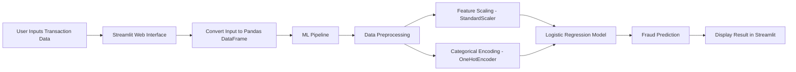

#  Fraud Detection System using Machine Learning
https://fraud-detectation-model-ml-sklearn.onrender.com


#                                                  End‑to‑End Fraud 


Detection System

This project implements an **End‑to‑End Machine Learning Fraud Detection System** capable of identifying **fraudulent financial transactions** based on transaction behavior and balance changes.

The system uses **Machine Learning + Streamlit deployment** to provide **real‑time fraud predictions**.

It demonstrates the complete **ML lifecycle**:

- Data preprocessing
- Feature engineering
- Model training
- Model evaluation
- ML pipeline creation
- Model serialization
- Deployment using Streamlit

This project simulates a **real‑world fintech fraud detection system** similar to those used by banks and payment companies.

---


#                                                   Problem Statement

Financial institutions process **millions of transactions daily**, and fraudulent activities cause **huge financial losses**.

Manual fraud detection is impossible at this scale.

Therefore, **machine learning models are used to automatically detect suspicious transactions** by analyzing patterns such as:

- Transaction type
- Transaction amount
- Account balances before and after transactions


#                                                     Key Features

✔ End‑to‑End ML pipeline implementation  
✔ Automatic preprocessing using **ColumnTransformer**  
✔ Machine learning model training and evaluation  
✔ Fraud prediction through a **Streamlit Web App**  
✔ Serialized ML pipeline using **Joblib**  
✔ Real‑time transaction prediction interface  


---


#                                                 Machine Learning Algorithm Used

## Logistic Regression

This project uses **Logistic Regression**, a powerful algorithm for **binary classification problems**.

Binary classification means the output has **two possible classes**:

| Class | Meaning |
|------|------|
| 0 | Legitimate Transaction |
| 1 | Fraudulent Transaction |

### Why Logistic Regression?

- Simple and interpretable
- Efficient on large datasets
- Works well for classification problems
- Fast prediction time
- Provides probability outputs

The model was trained using **Scikit‑Learn**.

---


#                                                    Machine Learning Pipeline

Instead of applying preprocessing manually each time, a **Scikit‑Learn Pipeline** is used.

The pipeline ensures that:

- Preprocessing
- Feature encoding
- Scaling
- Model prediction

all happen automatically.

---


###                                                  Model Configuration

The model was configured as:

- **Algorithm:** Logistic Regression
- **Class Weight:** Balanced (to handle class imbalance)
- **Max Iterations:** 1000

Fraud datasets are usually **highly imbalanced**, where fraudulent transactions are very rare compared to legitimate ones.  
Using **class_weight='balanced'** helps the model pay more attention to minority fraud cases.


#                                                      Project Architecture



---

#  Project Structure

```
Fraud-Detection-Project
│
├── analysis_model.ipynb
│     Machine Learning development notebook
│
├── fraud_detectation.py
│     Streamlit web application for predictions
│
├── fraud_detection_pipeline.pkl
│     Saved trained machine learning pipeline
│
└── README.md
      Project documentation
```


---

#                                                 Dataset Features

| Feature | Description |
|------|------|
| type | Type of transaction |
| amount | Transaction amount |
| oldbalanceOrg | Sender balance before transaction |
| newbalanceOrig | Sender balance after transaction |
| oldbalanceDest | Receiver balance before transaction |
| newbalanceDest | Receiver balance after transaction |
| isFraud | Target variable (Fraud or Not) |

Transaction types include:

- PAYMENT
- TRANSFER
- CASH_OUT
- DEPOSIT

---


#                                                 Machine Learning Pipeline

To automate preprocessing and training, a **Scikit‑Learn Pipeline** was created.

The pipeline contains two main stages:


# 1.  Data Preprocessing

Before training the model, the data must be prepared.

### Numerical Features

These include:

- amount
- oldbalanceOrg
- newbalanceOrig
- oldbalanceDest
- newbalanceDest

These are standardized using:

**StandardScaler**

Standardization improves ML performance.

---

### Categorical Features

Transaction type is categorical:

Example:

```
PAYMENT
TRANSFER
CASH_OUT
DEPOSIT
```

These are converted into numerical vectors using:

**OneHotEncoder**

Example:

```
PAYMENT → [1,0,0,0]
TRANSFER → [0,1,0,0]
CASH_OUT → [0,0,1,0]
DEPOSIT → [0,0,0,1]
```

---

# 2. Model Training Process

The model training process followed these steps:

1️⃣ Load dataset using **Pandas**

2️⃣ Explore data using **Matplotlib and Seaborn**

3️⃣ Separate features and target variable

4️⃣ Perform **Train-Test Split**

Typical split:

```
80% Training Data
20% Testing Data
```

5️⃣ Create preprocessing pipeline

6️⃣ Train Logistic Regression model

7️⃣ Evaluate performance

---


#                                              Model Training Process

The following steps were used to train the model:

1️⃣ Dataset loaded using **Pandas**

2️⃣ Data exploration and visualization performed using:

- Matplotlib
- Seaborn

3️⃣ Features separated into:

- Numerical features
- Categorical features

4️⃣ Data split using **Train-Test Split**

Typical split:

```
80% Training Data
20% Testing Data
```

5️⃣ Pipeline created using **Scikit‑Learn Pipeline**

6️⃣ Model trained on training data

7️⃣ Performance evaluated using:

- Confusion Matrix
- Classification Report
- ROC-AUC Score

---


#                                              Model Evaluation Metrics

To evaluate the model performance, the following metrics were used.

## Confusion Matrix

Shows:

- True Positives
- True Negatives
- False Positives
- False Negatives

---

## Classification Report

Includes:

- Precision
- Recall
- F1 Score

These metrics are critical in **fraud detection systems**.

Why?

Because **detecting fraud is more important than just accuracy**.

---


##                                              ROC‑AUC Score

Measures the model's ability to distinguish between:

- Fraud
- Non‑Fraud

Higher values indicate **better model performance**.

---


#                                              Model Saving

After training, the complete pipeline was saved using **Joblib**.

```python
joblib.dump(pipeline, "fraud_detection_pipeline.pkl")
```

This saves:

- preprocessing steps
- trained model

allowing reuse without retraining.


---


#                                               Streamlit Web Application

The project includes a **Streamlit Web App** for real‑time predictions.

Users can enter transaction details and instantly check whether a transaction is fraudulent.

###                                              Inputs in the App

- Transaction Type
- Transaction Amount
- Sender Old Balance
- Sender New Balance
- Receiver Old Balance
- Receiver New Balance

---


#                                                 Prediction Workflow

1️⃣ User enters transaction details

2️⃣ Streamlit collects the input

3️⃣ Input converted into **Pandas DataFrame**

4️⃣ Data passed into **trained ML pipeline**

5️⃣ Pipeline performs:

- encoding
- scaling
- prediction

6️⃣ Model outputs:

```
0 → Not Fraud
1 → Fraud
```

7️⃣ Result displayed in Streamlit interface

---


#                                                Running the Project

## Step 1 — Install Dependencies

```
pip install pandas scikit-learn matplotlib seaborn streamlit joblib
```

---

## Step 2 — Run the Streamlit App

```
streamlit run fraud_detectation.py
```

---

## Step 3 — Open in Browser

```
http://localhost:8501
```

---


#                                                 Technologies Used

| Technology | Purpose |
|------|------|
Python | Programming Language |
Pandas | Data processing |
NumPy | Numerical computation |
Scikit‑Learn | Machine learning |
Matplotlib | Data visualization |
Seaborn | Statistical visualization |
Joblib | Model serialization |
Streamlit | Web application |

---


#                                                 Skills Demonstrated

This project demonstrates important **Machine Learning Engineering skills**:


- End-to-end ML pipeline design
- Data preprocessing automation
- Handling categorical and numerical features
- Fraud detection model development
- Model evaluation and interpretation
- Model serialization
- Web deployment with Streamlit

---


#                                                   Future Improvements

Possible upgrades:

- Random Forest model
- XGBoost model
- Hyperparameter tuning with GridSearchCV
- Handling class imbalance using SMOTE
- SHAP explainability
- Cloud deployment (AWS / GCP)

---

######

Machine Learning- 

- End‑to‑End ML Pipeline
- Fraud Detection System
- Model Deployment

---
